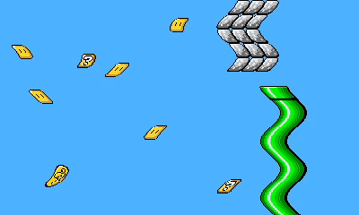

# 3DS Homebrew Demo: Scanline Offset Shader

This repo contains a homebrew demo for the 3DS the replicates the common retro game console effect of offsetting scanlines horizontally. It's done here through a geometry shader that when given an Nx16 sprite, makes 16 one-pixel-tall strips (2 triangles each). Each strip is then offset by indexing into an array uniform that contains a value for every y-value on the screen.

Contained here is the entirety of [citro2d](https://github.com/devkitPro/citro2d), hackily edited to work with this. it was done just for convenience - you could certainly make it play nicely with citro2d without having to edit it.

Please feel free to use this however you want!